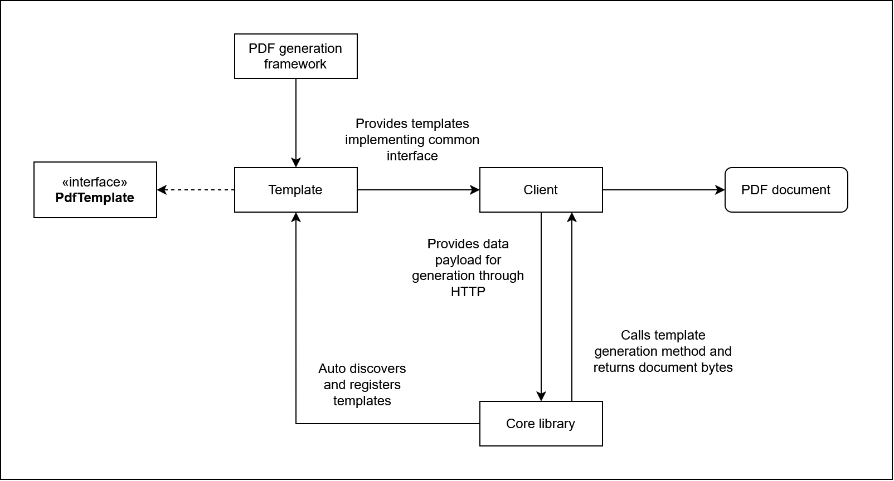
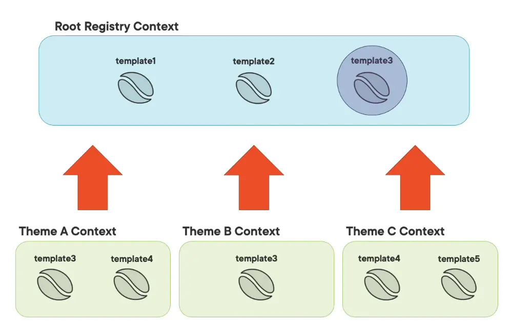
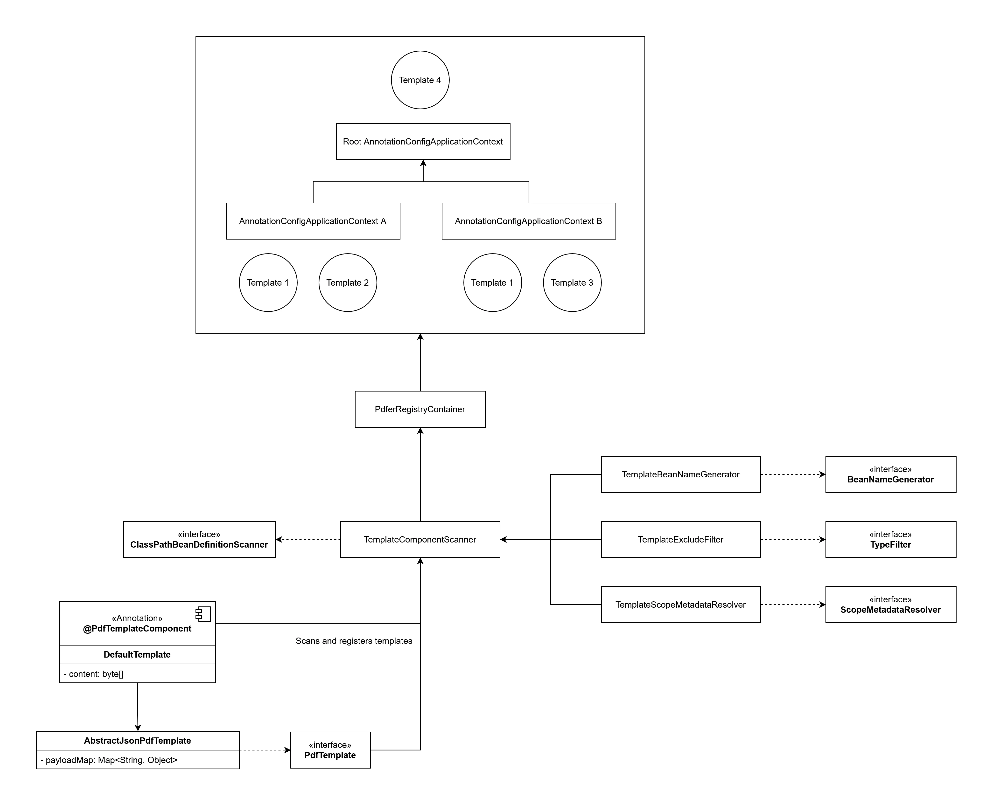

# PDF Generation Library

### Summary

- [Overview](#overview-)
- [Projects](#projects-)
  - [`pdfer-template`](#pdfer-template-)
  - [`pdfer-templates`](#pdfer-templates-)
  - [`pdfer-core`](#pdfer-core-)
  - [`pdf-client`](#pdf-client-)

<br>

## Overview [🔼](#summary)

- Modular PDF generation library.

- Supports custom templates and PDF generation implementations.

- New templates can be registered under a `pdfer.templates` package, library provide generation endpoint and capabilities out of the box though a **common abstraction**.

- The parent project exposes a custom `pdfer-java-common` **gradle plugin** for **common configuration**, including `java` and `java-library` plugins, though the use of [buildSrc](https://docs.gradle.org/current/userguide/sharing_build_logic_between_subprojects.html).

<br>



<br>

## Projects [🔼](#summary)

### `pdfer-template` [🔼](#summary)

- Provides :

  - A common `PdfTemplate` interface for templates.

  - A custom `@PdfTemplateComponent` annotation for template classes for defining template name, group and scope when registering templates with the application context :

    - `name` (**mandatory**) : used as the name of the bean.
    - `group` (**optional**) : associated with its own context. Default at root level.
    - `scope` (**optional**) : singleton or prototype. Default as a prototype bean.

  - An `AbstractJsonPdfTemplate` to convert a JSON payload into a map to work with templates.

- Interface **decouples** client code from actual framework used to generate PDF documents.

  - Libraries can generate PDF documents using multiple means as long as they implement `PdfTemplate` and are annotated with `@PdfTemplateComponent`.

- This library is exposed to custom template libraries and applications as a transitive dependency, as well as internal dependency for the `pdfer-core` library.

- Users can create custom templates by importing this library only, **without depending on the core library**.

<br>

> Templates must be registered within the `pdfer.templates` package.

#
### `pdf-templates` [🔼](#summary)

- Example of **client library** to hold user-defined templates.

- The **choice of implementation library** for templates is up to the user, as long as templates implement `PdfTemplate` and are annotated with `@PdfTemplateComponent`.

- Templates implementations are responsible for converting entities and DTO payloads to graphical PDF elements and insert them into the document.

- Each template holds a `ByteArrayOutputStream` used by the core library to provide the document through various means.

- This project uses the [iText library](https://itextpdf.com/).

#
### `pdfer-core` [🔼](#summary)

- Core library for PDF generation :

  - Discovers and registers templates within specified package.
  - Provides default capabilities such as a generation API endpoint.

- A custom **component scanner** (`TemplateComponentScanner`) is implemented to register template beans with the following rules :

  - Implements `PdfTemplate`.
  - Annotated with `@PdfTemplateComponent`.
  - Found within `pdfer.templates` package.

    <br>

    ``` java
    // Only matches beans with @PdfTemplateComponent annotation.
    addIncludeFilter(new AnnotationTypeFilter(PdfTemplateComponent.class));

    // Excludes beans not implementing PdfTemplate.
    addExcludeFilter(new TemplateExcludeFilter());

    // Sets bean name from @PdfTemplateComponent parameter.
    setBeanNameGenerator(new TemplateBeanNameGenerator());

    // Sets bean scope from @PdfTemplateComponent parameter.
    setScopeMetadataResolver(new TemplateScopeMetadataResolver());
    ```
    <br>

- Templates can be **grouped** by defining the `group` attribute of `@PdfTemplateComponent` annotation :

  - `PdfTemplate` beans are registered with a **different application context for each group** :

      <br>

      

      <br>

  - Each subcontext is a child of the root context and has its own set of `PdfTemplate` registered beans.

  - Group templates will override any matched root-level template.

  - Root context is different from the main Spring application context.

  - This allows templates to be part of multiple groups under the same name for flexibility.

  - This mechanism prevents using a simple `@ComponentScan` annotation to define **inclusion** and **exclusion filters**, **name** and **scope resolvers**, like so :

      ``` java
      @ComponentScan(
          basePackages = BASE_PACKAGE,
          useDefaultFilters = false,
          excludeFilters = @ComponentScan.Filter(type = FilterType.CUSTOM, value = TemplateExcludeFilter.class),
          includeFilters = @ComponentScan.Filter(type = FilterType.ANNOTATION, value = PdfTemplateComponent.class),
          nameGenerator = TemplateBeanNameGenerator.class,
          scopeResolver = TemplateScopeMetadataResolver.class
      )
      ```
      <br>

- Subcontexts with their registered templates are kept in a **registry** : `Map<String, AnnotationConfigApplicationContext> templateRegistries`.

- The `PdferRegistryContainer` component :

  - Launches the scan and starts all contexts.
  - Exposes methods to find and list templates.

<br>



<br>

**<ins>Capabilities</ins>** :

- A **generation and download endpoint** is autoconfigured :

  - Receives a template ID and a `GenerationRequest` with desired filename and payload.

  - Calls service to generate the document bytes and return response as attachment.

  - **Conditional configuration** :

    - Enabled with `pdfer.web.endpoint.enable`.
    - Can customize `pdfer.web.endpoint.base_uri` and `pdfer.web.endpoint.generate-uri` (default `pdfer/generate`).

#
### `pdf-client` [🔼](#summary)

- Small MVC client to test PDF generation. Provides a simple page to select registered templates in list and generate the PDF document.

- The page only supports JSON templates as it will ask for a JSON payload and convert it to a map before sending it to the generation endpoint.